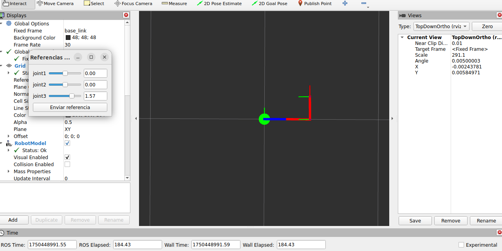

# Simulación de la dinámica y el control de un doble péndulo

## Pre requisitos

Este entorno de simulación debería funcionar en cualquier versión de Ubuntu posterior a 20.04.

El uso de Ubuntu no es obligatorio, cualquier entorno que pueda compartir el acceso a la placa de video debería funcionar.
Sin embargo debido a las complejidades que involucra es altamente recomendado utilizar dicha distribución.

### Instalar docker
```
sudo apt install curl
curl -sSL https://get.docker.com/ | sh
sudo usermod -aG docker $(whoami)
```

Cualquier consulta: https://docs.docker.com/get-started/get-docker/

Es importante asegurarse que el sistema tiene el plugin para `docker compose`.
https://docs.docker.com/compose/install/linux/

```
 sudo apt-get update
 sudo apt-get install docker-compose-plugin
```

## Para configurar el espacio:
```
git clone https://github.com/pgonfiuba/ros2_dp.git
cd ros2_dp/docker
docker compose build
```

## Para ejecutar una de las simulaciones:

Existen varias simulaciones. Levantando el contenedor con la opción dp se accede a una simulación del control del doble péndulo que permite cambiar setpoints y ganancias.
La evolución temporal de las variables se pueden configurar en plotjuggler cargando el tópico correspondiente. 

```
$ xhost + && docker compose up dp --force-recreate
```

Deberia inmediatamente inicializar la simulacion con el panel de control de RViz, Gazebo, PlotJuggler y una gui para cambiar parámetros, como se ve:




## Como usar este repositorio para desarrollo:

Reconstruimos la imagen e inicializamos una nueva:
```
$ docker compose build --no-cache
$ xhost + && docker compose up dp_dev --force-recreate
```

En este caso no se levanta ros2, por lo que se debe hacer manualmente desde una segunda consola, con la opción de levantar otras simulaciones tales como el péndulo doble corriendo sobre un escritorio sin estar fijo en su base.

En una terminal separada nos introducimos en el container.
```
$ docker exec -it docker-dp_dev-1 /bin/bash
```

Luego adentro no olvidar de sourcear
```
$ source /entrypoint.sh
```

En esta forma, cualquier cambio en la carpeta `./src/dp` se reflejan en la carpeta `/root/ros2_ws/src/dp` adentro de la contenedor.
Asi podemos hacer cualquier cambio  dentro de esa carpeta y ejecutarlos  en el sistema con el comando desde la segunda terminal.

## Simulación de péndulo doble con control PID
Es la simulación por defecto en el servicio dp. Para mayor control se entrar por consola mediante el servicio dp-dev y luego se corre:

```
$ ros2 launch dp dp_sim.launch.py 
```

Si se desea ver la evolución temporal de las variables desde otra consola se puede correr:

```
$ ros2 run plotjuggler plotjuggler
```

## Modificación de ganancias dinámicamente

Es posible correr una aplicación gráfica para modificar las ganancias de los controladores PID de los position_controllers.
Con la simulación corriendo en lazo cerrado, se abre una consola al contenedor y se ejecuta la aplicación 

```
$ ros2 run dp gui_controller.py
```

Modificando las ganancias y enviándolas al controlador se puede alterar el comportamiento del doble péndulo que se puede observar en RViz y la posición de los ejes con plotjuggler.

## Simulación de péndulo doble a lazo abierto
Se puede lanzar una simulación con el control de lazo cerrado desactivado e ingresar con torques en los ejes mediante el siguiente comando.

```
$ ros2 launch dp dp_sim.launch.py closed_loop:=false
```

Adicionalmente se puede correr la definición del robot que viene sin conexión a motores, sin rozamiento y sin límites de posición, velocidad y torque en los ejes. Esto permite reproducir un movimiento caótico.

```
$ ros2 launch dp dp_sim.launch.py closed_loop:=false xacro_file:=dp_caos.xacro
```

## Simulación del péndulo suelto
Adicionalmente se puede configurar la simulación para que el péndulo esté libre; es decir que su base no esté fijada al mundo.
La idea de esta simulación es ver el potencial de Gazebo, ya que no se limita a calcular la evolución del doble péndulo sino que el enfoque para resolver la dinámica es integral.

Como adicional, se puede importar un mundo con un escritorio de manera que el péndulo quede apoyado arriba del mismo. Cuando se acciona el robot golpea al escritorio y este se mueve.

```
$ ros2 launch dp dp_sim.launch.py closed_loop:=false xacro_file:=dp_loose.xacro world_name:=dp_escritorio.world
```

## Estructura de la definición de robots

Los parámetros cinemáticos y dinámicos del mecanismo y los actuadores están definidos en dp_params.xacro

Luego dp_base.xacro importa los parámetros para definir el robot junto con los controladores de posición. Además deja configurada una interfase para entrar con torques en los ejes (útil para la simulación de lazo abierto)

dp_caos.xacro redefine los valores de los rozamiento y los topes de los ejes.

dp_loose.xacro libera al robot de la junta fija a world. Esto podría ser útil para un robót móvil aunque, pero no para un manipulador.
